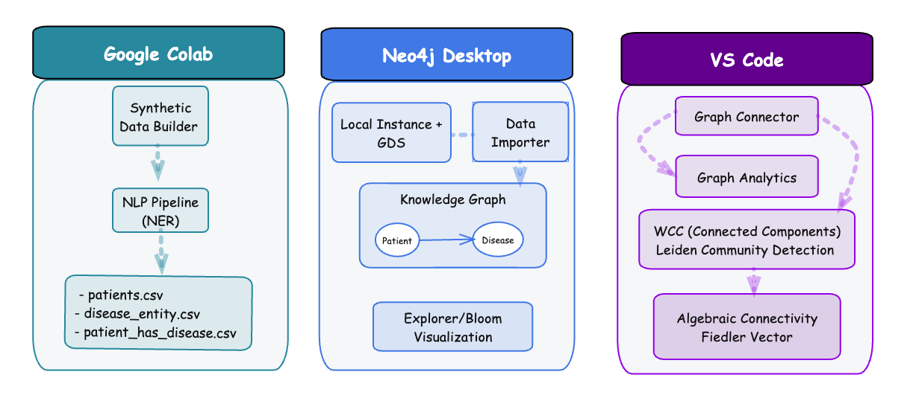

# Spectral Community Detection in Clinical Knwoledge Graphs

This repository contains all code, data, and intermediate results used in my blog post Spectral Community Detection in Clinical Knowledge Graphs. 

---


*Figure: High level workflow diagram*

---

## File Structure
```
├── data/
│   ├── synthetic_hpi_cases_1k_combined.csv
│   ├── patients.csv
│   ├── disease_entity.csv
│   └── patient_has_disease.csv
│
├── Synthetic_Data.ipynb          # Synthetic data generation
├── NER_Pipeline.ipynb            # NER pipeline (Google Colab)
├── KG_Analysis.ipynb             # KG & spectral analysis
│
├── workflow.png                  # End-to-end workflow diagram
├── pyproject.toml                # Project dependencies
└── README.md

```

---

## 1. Environment Setup

### Create a virtual environment locally

You can use either `uv` or `pip` to manage your environment. All required dependencies are listed in `pyproject.toml` and will be installed automatically when you initialize the project. Additional packages can be added with `uv add` or `pip install` as needed.

```
mkdir GraphProject
cd GraphProject
uv init
source .venv/bin/activate
```

### Set Up Neo4j Desktop

For this project, we will use Neo4j Desktop, which provides full access to all Neo4j features and is ideal for small to medium-size graphs. Here are the steps to get started:

1. Install Neo4j Desktop (version 2025.09.0 or later).
2. Create a new database instance and set up your password.
3. Install the following plugins:
    - Graph Data Science (GDS) — needed for this project
    - APOC (Awesome Procedures on Cypher) — nice to have
4. Restart the instance to activate the plugins.


## 2. Build Synthetic_Data.ipynb

- Notebook: `Synthetic_data.ipynb`

Generates synthetic patient cases using structured prompts and builds the base dataset 
- `synthetic_hpi_cases_1k_combined.csv`.

For this part you will need an OpenAI API Key if you want to generate new data, or you can use the data provided here.

## 3. Extract Disease Entities

- Notebook: `NER_Pipeline.ipynb`

Designed to run on Google Colab. It extracts and parses the entities and relations from the synthetic data. The output consists of 
- `patients.csv` -- unique patients list
- `disease_entity.csv`-- unique entities list 
- `patient_has_disease.csv` -- relationships list

## 4. Import the Data into Neo4j

Once we have the CSV files prepared (patients, diseases, and relationships), Neo4j Desktop’s visual import interface makes graph creation straightforward:

1. Click the `Import` button on the left sidebar to open the data importer tool.
2. Upload the three CSV files.
3. Add nodes, labels and their properties extracted from the uploaded files.
4. For each node specify the unique identifiers (e.g. `patient_id` for patients, `entity_id` for diseases) — this is an important step.
5. Create relationships using the information from the `patient_has_disease.csv` to connect the appropriate nodes.
6. Save the generated Cypher code for reproducibility.

See also:  [Neo4j Documentation](https://neo4j.com/docs/desktop/current/installation/).


## 5. Knowledge Graph Analysis

- Notebook: `KG_Analysis.ipynb`

Runs on VS Code (using the virtual environment previously built). Contains code to connect to the Neo4j instance, perform graph analytics, community detetion and spectral analysis.

---

**License**: MIT License.

**If you find this useful, consider starring the repo!**

